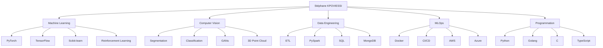

# Stéphane KPOVIESSI | Machine Learning Engineer 👨‍💻

## 🤖 À propos de moi

Ingénieur Big Data et Machine Learning passionné par la vision par ordinateur et l'apprentissage par renforcement. Je combine rigueur mathématique et implémentation pratique pour développer des solutions d'IA innovantes, de la conception des modèles jusqu'au déploiement en production.

> 🔭 Je travaille actuellement sur des projets d'apprentissage par renforcement et de modèles génératifs
> 
> 🌱 J'apprends TypeScript pour diversifier mes compétences frontend
> 
> 💡 J'aime partager mes connaissances et découvertes en apprentissage public

## 🛠️ Compétences Techniques

### Langages et Frameworks

### Bibliothèques IA

### Outils et Plateformes

## 📚 Publications et Apprentissage en Public

Je partage régulièrement mes découvertes et apprentissages en IA et Data Science :

- [Classification de Tumeurs Cérébrales par IRM](https://kaggle.com/votre-notebook) - Notebook Kaggle
- [Système de Détection des Pathologies Végétales](https://huggingface.co/spaces/votre-demo) - Démo HuggingFace
- [Tutoriel: Implémentation de GANs pour la génération d'images](https://votre-lien-medium)
- [Applications concrètes des mathématiques en IA](https://votre-lien-article)

## 📫 Me contacter

- LinkedIn: [stephanekpoviessi](https://www.linkedin.com/in/stephanekpoviessi)
- Email: stephane.kpoviessi@student.junia.com
- Twitter: [@VotreCompte](https://twitter.com/VotreCompte)

---

⚡ *"Les données sont le nouveau pétrole, mais les algorithmes sont les nouveaux moteurs."*
